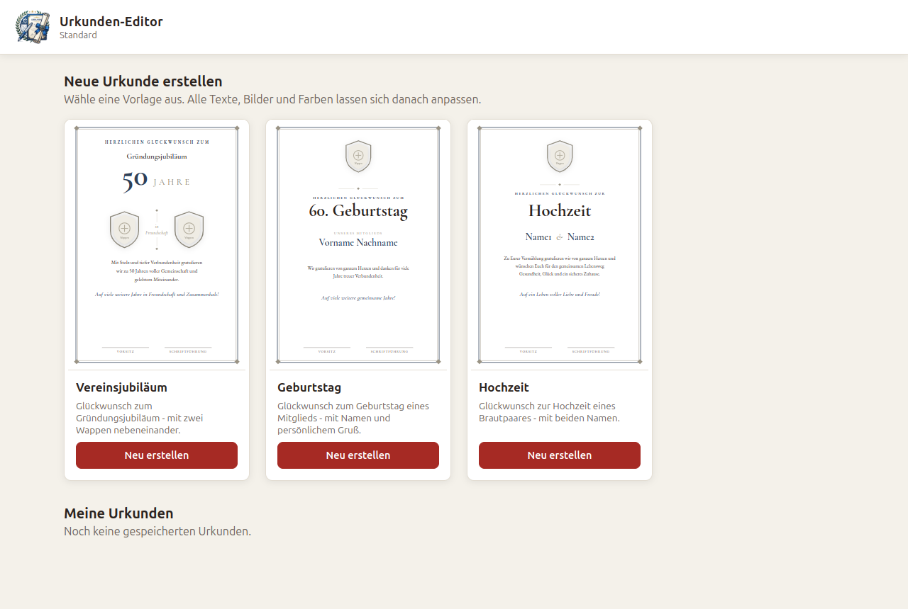
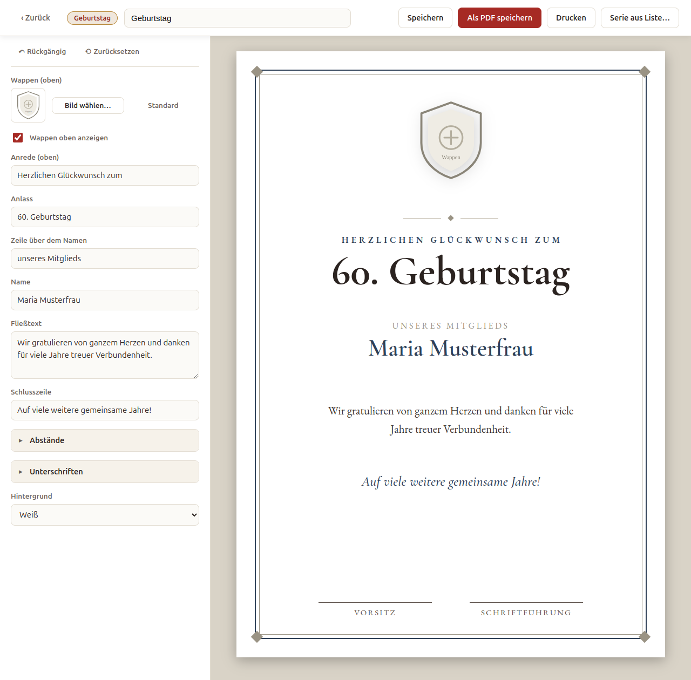

# Urkunden-Editor

Eine kleine Desktop-App, um Urkunden aus fertigen Vorlagen auszufüllen, als **PDF** zu
speichern oder direkt zu **drucken**. Alle Texte, Wappen/Bilder und die Hintergrundfarbe
lassen sich anpassen. Ausgefüllte Urkunden können gespeichert und später wieder geöffnet werden.

Wer die App einsetzt, baut sich daraus eine eigene Variante - mit eigenen
Vorlagen, eigener Optik und eigenem Installer. Mitgeliefert ist die Variante
`standard`.

Die App funktioniert komplett **offline** (Schriften sind eingebettet).



*Jede Karte startet eine neue Urkunde aus dieser Vorlage; eine eigene Variante kann weitere
Karten hinzufügen, ohne den Kern anzufassen.*



*Die Vorschau rechts zieht bei jeder Änderung sofort nach - ganz ohne eigenen
Aktualisieren-Schritt.*

## Für Anwender: So wird eine Urkunde erstellt

1. App starten.
2. Unter **„Neue Urkunde erstellen"** eine Vorlage anklicken (**Neu erstellen**).
3. Links die Felder ausfüllen - die Vorschau rechts aktualisiert sich sofort.
   - **Bild wählen…** tauscht ein Wappen gegen eine eigene Bilddatei; **Standard** setzt es zurück.
4. Oben einen **Titel** eingeben und **Speichern** (zum späteren Wiederöffnen unter „Meine Urkunden").
5. **Als PDF speichern** → Speicherort wählen; das PDF öffnet sich anschließend automatisch.
   Oder **Drucken** → normaler Druckdialog.

Die fertige Urkunde ist ein randloses **A4-Blatt** (Hochformat).

## Viele Urkunden auf einmal

Für einen Wettkampf steht die Teilnehmerliste meist schon vorher fest. Statt
jede Urkunde einzeln auszufüllen:

1. Eine Urkunde wie gewohnt öffnen und alles ausfüllen, was für **alle** gleich
   ist (Anlass, Datum, Unterschriften). Diese Urkunde ist die Vorlage für die
   ganze Serie.
2. **Serie aus Liste…** anklicken.
3. **Muster-CSV speichern…** - die Datei hat für jedes Feld eine Spalte und
   eine Beispielzeile mit deinen Werten.
4. Die Datei in Excel öffnen, je Teilnehmer eine Zeile ausfüllen, die
   Beispielzeile überschreiben oder löschen, und als CSV speichern.
5. **CSV wählen…** - die App zeigt, wie viele Zeilen sie gelesen hat, welche
   Spalten sie erkannt hat und was auffällig ist, dazu die Vorschau der ersten
   Urkunde mit echten Daten. Mit **Letzte Zeile** lässt sich prüfen, ob eine
   Summen- oder Kommentarzeile am Listenende mitgeraten ist.
6. **Ein PDF mit allen Urkunden**, **Einzeldateien…** in einen Ordner oder
   direkt **Drucken**. Bei Einzeldateien wird vorher gewählt, aus welchen
   Spalten sich der Dateiname jeder Urkunde zusammensetzt.

Spalten, die die App nicht kennt (etwa eine Startnummer), werden ignoriert.
Fehlt eine Spalte, bleibt der Wert aus deiner Vorlage stehen - und ebenso, wenn
eine Zelle leer bleibt: dann gilt, was du in der Urkunde eingestellt hast. Soll
ein Feld auf allen Urkunden leer sein (etwa die Punktzahl zum Eintragen von
Hand), lass es schon in der Vorlage leer.

## Vorlagen

Die Standard-Variante bringt drei Vorlagen mit, die sich eine Hausoptik teilen
(doppelter Zierrahmen, Eckrauten, gemeinsame Schriften):

- **Vereinsjubiläum** (zwei Wappen nebeneinander)
- **Geburtstag** (mit Name des Mitglieds)
- **Hochzeit** (Brautpaar)

Farben, Rahmen und Texte lassen sich je Variante ändern, ohne die Vorlagen
anzufassen - siehe „Eine neue Variante hinzufügen".

## Für Entwickler

### Starten (Entwicklung)

```bash
npm install
npm run dev                    # Variante standard
VARIANT=<id> npm run dev       # andere Variante
```

### Installer bauen

```bash
npm run build:linux:standard   # AppImage + .deb (Ordner dist/)
npm run build:win:standard     # NSIS-Installer .exe (unter Windows, oder mit Wine)
```

### Projektstruktur

```
src/
  main.js            Electron-Hauptprozess: Fenster, PDF/Druck, Dialoge, Variantenwahl
  preload.js         sichere Brücke (window.api)
  main/storage.js    Speichern der Urkunden (JSON im userData-Ordner)
  main/variant.js    Varianten-Lookup und Feld-Merge (Shell, Vorlage, Overrides)
  renderer/          Oberfläche: Galerie, Formular, Live-Vorschau
templates/
  base.css           gemeinsame Hausoptik der geteilten Vorlagen (hier zentral ändern)
  shell.html         geteilter Rahmen + Unterschriftsblock
  shell.fields.json  Felder, die die geteilte Shell mitbringt (Kopf, Unterschriften)
  <vorlage>/
    template.html    Inhaltslayout mit data-field-Platzhaltern
    manifest.json    Felder der Vorlage (Beschriftung, Typ, Standardwert)
variants/
  <id>/
    variant.json     Name, Vorlagenliste, Text-Overrides
    shell.html       eigener Rahmen (optional, sonst templates/shell.html)
    shell.fields.json  Felder, die die Shell mitbringt (Kopf, Unterschriften)
    base.css         eigene Optik (optional, ersetzt templates/base.css ganz)
    assets/          Logos und Bilder dieser Variante
    templates/<vorlage>/  eigene Vorlagen; gleichnamige gewinnen über templates/<vorlage>/
build/
  builder.<id>.yml   Installer-Metadaten dieser Variante
assets/
  fonts/fonts.css    lokal eingebettete Schriften (auto-generiert)
test/       automatisierte Tests (node --test)
tools/      Hilfsskripte für Entwicklung und Build, z. B. fetch-fonts.mjs
docs/       Screenshots für dieses README
```

### Eine neue Vorlage hinzufügen

1. Ordner `templates/<neue-id>/` anlegen mit `template.html` und `manifest.json`
   (am einfachsten eine vorhandene Vorlage kopieren und anpassen).
2. In `template.html` nur die **innere Inhaltsspalte** angeben; jedes editierbare
   Element bekommt ein `data-field="schlüssel"`. Rahmen, Eckrauten und Unterschriften
   kommen automatisch aus `shell.html` / `base.css`.
3. In `manifest.json` die Felder beschreiben. Die `key`s müssen zu den
   `data-field`-Werten passen. Feld-Typen:
   - `text`, `textarea`, `number` - Textinhalt
   - `select` - Auswahl (mit `options`)
   - `image` - Bild tauschen (Datei → wird als Base64 gespeichert)
   - `checkbox` - blendet das zugehörige `data-field`-Element ein/aus
   - `range` - Schieberegler; setzt entweder eine CSS-Eigenschaft des Elements
     (`"styleProp":"gap","unit":"px"`) oder - mit `"cssVar":"--name"` - eine
     CSS-Variable auf der Urkunde (z. B. für Abstände, kein `data-field` nötig).
   - `range` mit `"bind":"count"` - Anzahl: das `data-field`-Element ist ein
     Container, dessen Kinder `data-count="1"`, `"2"`, … tragen; sichtbar
     bleiben so viele, wie eingestellt sind (etwa für ein Teilnehmerpaar,
     das je nach Urkunde ein- oder zweizeilig steht).
4. Optional Felder in einen **ausklappbaren Block** legen: `"group":"<id>"` am Feld
   und den Block unter `"groups": { "<id>": { "label":"…", "collapsed":true } }`
   beschreiben (siehe die „Abstände"-Gruppe der vorhandenen Vorlagen).
5. Die neue `id` in die `templates`-Liste der jeweiligen `variant.json` einsortieren
   (keine `index.json` mehr - die Reihenfolge steht pro Variante).
6. Wappen-Kopf, Unterschriften und Hintergrundwahl gehören nicht zur Vorlage, sondern
   kommen aus `shell.fields.json` (geteilt oder der Variante). Eine Vorlage justiert nur
   deren Standardwerte über `shellDefaults` im eigenen `manifest.json`.

**Abstände zwischen Abschnitten** werden über CSS-Variablen gesteuert: die Abschnitte
nutzen `margin-top: calc(var(--mt-xyz, Basis) * var(--gap-scale, 1))`. Ein `range`-Feld mit
`"cssVar":"--mt-xyz"` regelt den Einzelabstand, eines mit `"cssVar":"--gap-scale"` den
Gesamtfaktor.

Der Editor und das Formular bauen sich automatisch aus dem Manifest - am Programmcode
muss nichts geändert werden.

### Eine neue Variante hinzufügen

1. `variants/<id>/variant.json` anlegen: `name`, `templates`
   (Reihenfolge der Karten in der Galerie), optional `overrides`.
2. Reicht die bestehende Optik, werden Shell und `base.css` von `templates/`
   geerbt, samt der neutralen Vorgaben aus `templates/shell.fields.json`.
   Eigene Wappen und Rollenbezeichnungen kommen entweder über `overrides` oder
   über eine eigene `shell.fields.json` im Varianten-Ordner.
   Ein eigenes Wappen braucht zusätzlich einen Ordner `variants/<id>/assets/`
   mit der Bilddatei, auf die der Override zeigt.
3. Eigene Optik: `shell.html`, `shell.fields.json` und `base.css` in den
   Varianten-Ordner legen. `base.css` wird **ganz** ersetzt, muss also alle
   Token und Klassen tragen, die Vorlagen *und* Shell benutzen:
   - Vorlagen: `--accent`, `--ornament`, `--ink`, `--muted`, `--hair`, `--bg`,
     `.divider`, `.signatures`
   - Shell: `.urkunde` (Seitenmaße, Schrift, `position: relative`),
     `.frame-outer`, `.frame-inner`, `.corner`, `.content`, `.emblem-head`,
     `.emblem-head .emblem`

   Fehlt eine Klasse, bleibt das beim Testen unbemerkt (`npm test` prüft keine
   Optik) und zeigt sich erst am Blatt: kein Rahmen, Wappen in Originalgröße.
4. Eigene Vorlagen unter `variants/<id>/templates/<vorlage>/` anlegen. Liegt
   dort eine Vorlage mit dem Namen einer geteilten, gewinnt die eigene.
5. Einzelne Texte einer geteilten Vorlage ändern: `overrides` in `variant.json`,
   nach Vorlagen-ID und Feldschlüssel. Ein unbekannter Schlüssel ist ein Fehler
   beim Start.
6. `build/builder.<id>.yml` nach dem Muster einer bestehenden anlegen: eigener
   `appId`, eigener `productName`, `extraMetadata.variant: <id>` und die eigene
   Variante in `files`. `files` ist eine positive Liste - fremde Varianten
   bleiben schon dadurch draußen, dass sie nicht aufgeführt sind. Ein
   `!`-Muster braucht nur, wer eine geteilte Vorlage aus dem Paket halten
   will, die die eigene Variante gar nicht anbietet.
7. Skripte `build:win:<id>` und `build:linux:<id>` in `package.json` ergänzen.
8. `npm test` - der Konsistenz-Test prüft die neue Variante automatisch mit.

Entwicklung mit einer anderen Variante: `VARIANT=<id> npm run dev`. Ohne
Angabe läuft `standard`.

**Wo die Urkunden liegen:** jede Variante speichert in einem eigenen Ordner,
benannt nach der Varianten-ID (`urkunden-editor-<id>` im Konfigurationsordner
des Benutzers). Das gilt in der Entwicklung wie im Installer und hängt
ausdrücklich nicht am Produktnamen: Electron leitet den Ordner sonst aus dem
Feld `name` der `package.json` ab, und das ist für alle Varianten dasselbe -
eine Urkunde der einen Variante tauchte dann bei der anderen unter „Meine
Urkunden" auf.

Die Variante, die eine Version ohne Varianten fortsetzt, trägt
`"vorgaengerSpeicher": true` in ihrer `variant.json` und übernimmt deren
Ordner einmalig.

### Varianten außerhalb des Projekts

Eigene Varianten müssen nicht im Projektordner liegen:

```bash
URKUNDEN_VARIANTS=/pfad/zu/meinen/varianten VARIANT=meinverein npm run dev
```

Gesucht wird in dieser Reihenfolge: `URKUNDEN_VARIANTS` (mehrere Pfade wie in
`PATH` getrennt), dann das Ressourcen-Verzeichnis der gepackten App, dann das
eigene `variants/`. Die Installer dieses Projekts nehmen ihre Variante über
`files` mit ins Paket und finden sie deshalb über den letzten Pfad; das
Ressourcen-Verzeichnis deckt den Fall ab, dass eine Variante per
`extraResources` daneben gelegt wird. So oder so braucht die fertige App
keinen Pfad nach außen.

### Prüfen, dass die Vorschau mitläuft

```bash
npm run test:e2e          # Variante standard
npm run test:e2e <id>     # andere Variante
```

Startet das Programm, öffnet die erste Vorlage, ändert ein Textfeld und prüft,
dass die Änderung in der Vorschau ankommt. Das lässt sich nur am laufenden
Programm prüfen: die Vorschau ist ein iframe, und ob der Renderer hineinschreiben
darf, entscheidet sich erst zur Laufzeit - eine zu strenge `sandbox` hat genau
das schon einmal stillschweigend abgeschaltet. Braucht eine Bildschirmanzeige
und läuft deshalb nicht in `npm test` mit.

### Schriften neu erzeugen (nur bei Bedarf)

`assets/fonts/fonts.css` enthält EB Garamond + Cormorant Garamond als eingebettete
woff2 (latin). `node tools/fetch-fonts.mjs` holt sie neu von Google Fonts und schreibt
die Datei komplett neu; im Normalbetrieb nicht nötig.

## Lizenz

MIT, siehe `LICENSE`.

Die eingebetteten Schriften EB Garamond und Cormorant Garamond stehen unter
der SIL Open Font License 1.1, siehe `assets/fonts/OFL.txt`.
